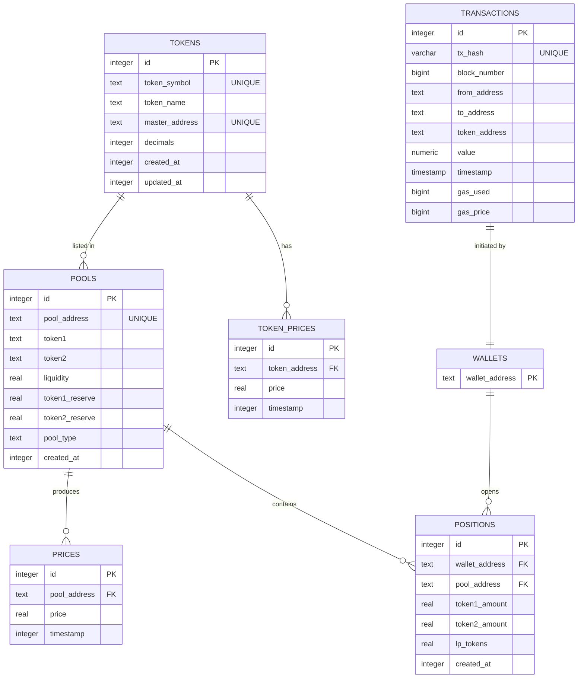

# Пояснительная записка к системе «TON DEX Analytics»

## 1. Назначение и область применения
Система «TON DEX Analytics» предназначена для мониторинга децентрализованных обменников (DEX) в блокчейне TON.  
Она собирает он-chain-данные (пулы ликвидности, сделки, цены токенов), сохраняет их в реляционную СУБД **PostgreSQL** и предоставляет REST-API для внешних сервисов — веб-панели аналитики, ботов и мобильных приложений.

Система будет использоваться:
* трейдерами для оценки глубины рынка и цен;
* разработчиками DeFi-сервисов — в качестве источника агрегированных показателей;
* исследователями блокчейна — для выгрузки сырых данных в формате CSV/JSON.

## 2. Функциональные требования
1. Индексация новых блоков TON и парсинг событий DEX-смарт-контрактов.  
2. Вычисление и сохранение цены каждого пула раз в N секунд.  
3. Хранение справочника токенов (symbol ↔ master-address, decimals).  
4. Сохранение информации о пулах (адрес, тип, токены, резервы, ликвидность).  
5. Учёт пользовательских позиций ликвидности.  
6. Хранение истории цен токенов в таблице `token_prices`.  
7. Предоставление REST-эндпоинтов:
   * GET `/pools` — список всех пулов;
   * GET `/pools/{address}/chart` — ценовой график;
   * GET `/wallet/{addr}/positions` — активные позиции пользователя;
   * GET `/tokens/{symbol}` — информация о токене.
8. Поддержка запросов фильтрации и пагинации.
9. Возможность группировать несколько SQL-операций в транзакцию при добавлении ликвидности.
10. Импорт/экспорт дампа БД через CLI-утилиту.

## 3. Нефункциональные требования
* СУБД — PostgreSQL 15, время ответа REST-API < 200 мс для 95-го перцентиля.
* Поддержка горизонтального масштабирования indexer-воркеров.
* Защита от повторного сохранения дубликатов (констрейнты `UNIQUE`).
* Актуальность данных ⩽ 30 секунд.
* Высокая наблюдаемость: логирование, метрики Prometheus.
* Резервное копирование БД каждую ночь.

## 4. Предварительная ER-схема (UML)


> **Примечание.** Таблица `wallets` в текущей реализации хранится имплицитно — адрес кошелька содержится в других таблицах; для чистоты ER мы вывели её явно.

## 5. Ограничения на данные (Функциональные и МЗ-зависимости)
* `TOKENS: master_address → token_symbol, token_name, decimals`
* `POOLS: pool_address → token1, token2, pool_type`
* `PRICES: (pool_address, timestamp) → price`
* `TOKEN_PRICES: (token_address, timestamp) → price`
* `POSITIONS: (wallet_address, pool_address) → token1_amount, token2_amount, lp_tokens`

## 6. Нормализация
Все таблицы приведены как минимум к 3НФ:
* каждый неключевой атрибут функционально зависит только от первичного ключа;
* транзитивных зависимостей нет (например, символ токена не хранится в `PRICES`).

## 7. Пример недонормализованной схемы и возможная аномалия
Допустим, мы объединим `PRICES` и `POOLS` в одну таблицу `pools_with_prices(pool_address, token1, token2, price, timestamp)`.  
При обновлении цены нужно будет вставлять новую строку, дублируя столбцы `token1`, `token2`.  
Это приведёт к **аномалии обновления**: изменение токенов в пуле потребует массового обновления исторических строк.

## 8. Скрипт SQL DDL (фрагмент)
```sql
CREATE TABLE IF NOT EXISTS tokens (
    id SERIAL PRIMARY KEY,
    token_symbol TEXT NOT NULL,
    token_name TEXT,
    master_address TEXT NOT NULL UNIQUE,
    decimals INTEGER NOT NULL DEFAULT 9,
    created_at INTEGER NOT NULL,
    updated_at INTEGER NOT NULL
);

CREATE TABLE IF NOT EXISTS pools (
    id SERIAL PRIMARY KEY,
    token1 TEXT NOT NULL,
    token2 TEXT NOT NULL,
    pool_address TEXT NOT NULL UNIQUE,
    liquidity REAL NOT NULL DEFAULT 0,
    token1_reserve REAL,
    token2_reserve REAL,
    pool_type TEXT,
    created_at INTEGER NOT NULL
);
/* остальные таблицы см. в файле core/db.py */
```
Полный DDL находится в `core/db.py:init_db()` и может быть выполнен командой:
```bash
python -c "from core.db import init_db; init_db()"
```

## 9. Примеры SQL DML-запросов
1. Получить последнюю цену пула:
   ```sql
   SELECT price
   FROM prices
   WHERE pool_address = :addr
   ORDER BY timestamp DESC
   LIMIT 1;
   ```
2. Добавить новую позицию ликвидности:
   ```sql
   INSERT INTO positions(wallet_address, pool_address, token1_amount, token2_amount, lp_tokens, created_at)
   VALUES (:wallet, :pool, :a1, :a2, :lp, EXTRACT(EPOCH FROM NOW()));
   ```
3. История цен токена за 7 дней:
   ```sql
   SELECT *
   FROM token_prices
   WHERE token_address = :token
     AND timestamp >= EXTRACT(EPOCH FROM NOW()) - 7*24*3600
   ORDER BY timestamp;
   ```

## 10. Группировка запросов в транзакции
Пример Python-кода (psycopg2) для атомарного добавления ликвидности:
```python
with conn, conn.cursor() as cur:
    # шаг 1: вставка позиции
    cur.execute("""
        INSERT INTO positions(...)
        VALUES (...)
    """)
    # шаг 2: обновление резерва пула
    cur.execute("""
        UPDATE pools
        SET token1_reserve = token1_reserve + %s,
            token2_reserve = token2_reserve + %s,
            liquidity      = liquidity      + %s
        WHERE pool_address = %s;
    """, (...))
# коммит произойдёт автоматически при выходе из блока
```

## 11. Пользовательский интерфейс
* **REST-API** реализован на **FastAPI** (см. `api/main.py`).  
  Пример запроса: `GET /api/v1/pools?token1=TON&token2=USDT`.
* **CLI**: `python indexer/run.py --from-block <n>` — запустить индексатор.
* Демонстрационный **Telegram-бот** подключается к тем же эндпоинтам; код — `src/main.py`.
